# Rocketing
"Rocketing" is a 2D soccer and basketball game played using cars, inspired by the well known console and PC game called Rocket League.

## Game Pages and Functionalities:

**Splash Screen**

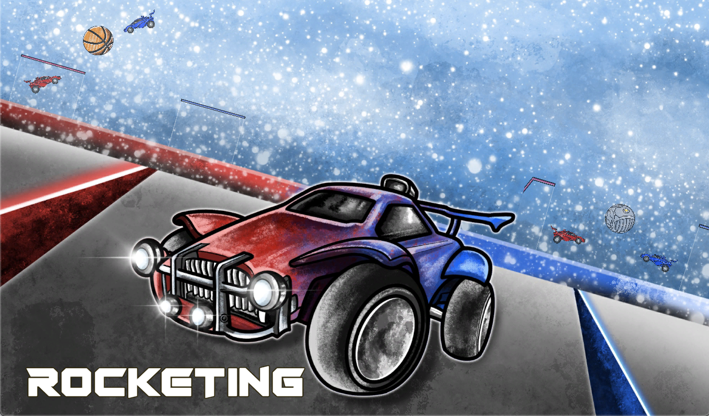

*This is the Splash Screen where intial game loads.*

---

**Main Menu Screen**

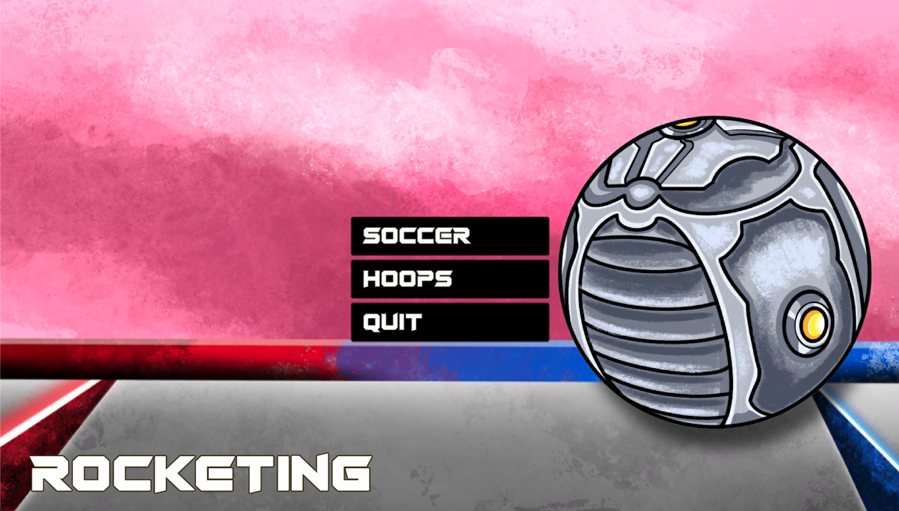

*This is the Main Menu Screen where the player is allowed to select either 'Soccer' or 'Hoops', or quit the application.*  

---

**Soccer Screens**

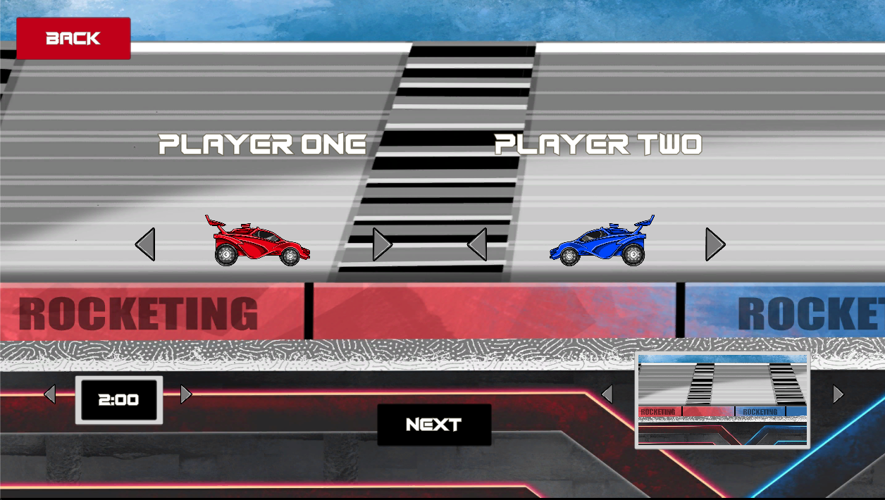 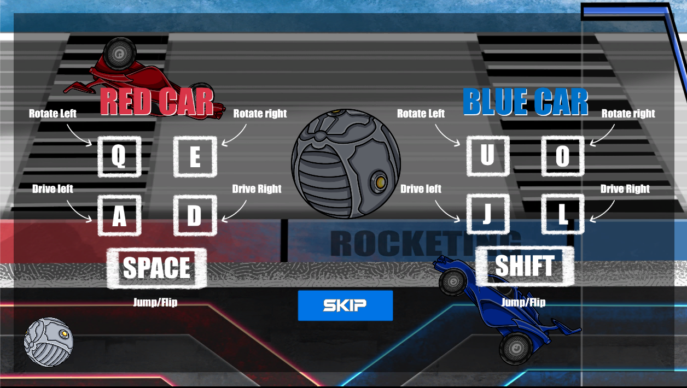
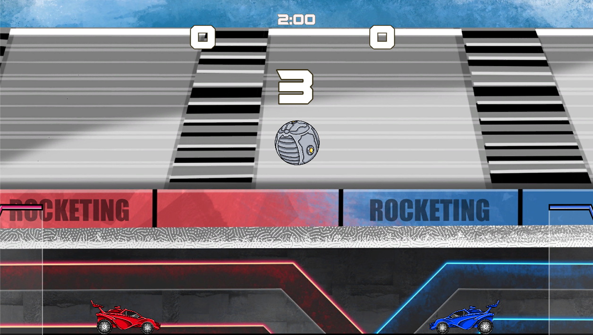
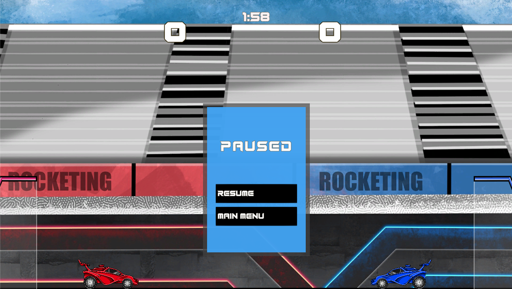
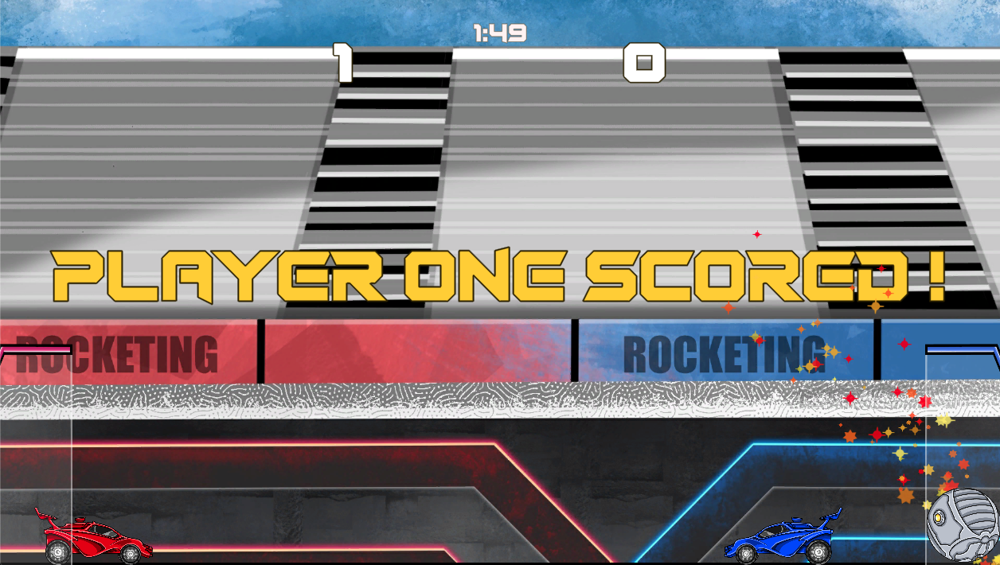
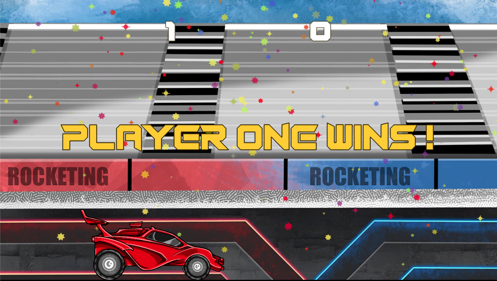
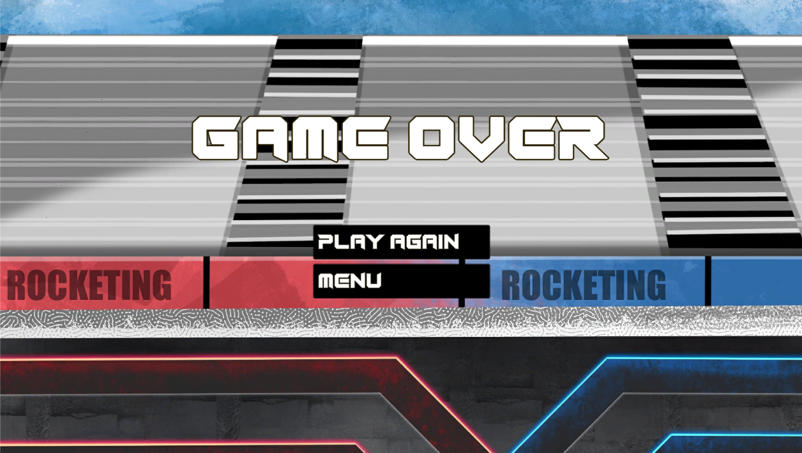

*The following images *

--- 

**Hoops Screens**

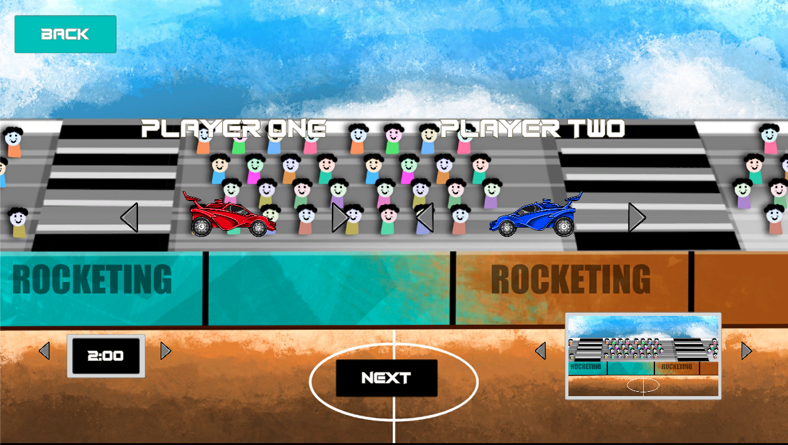 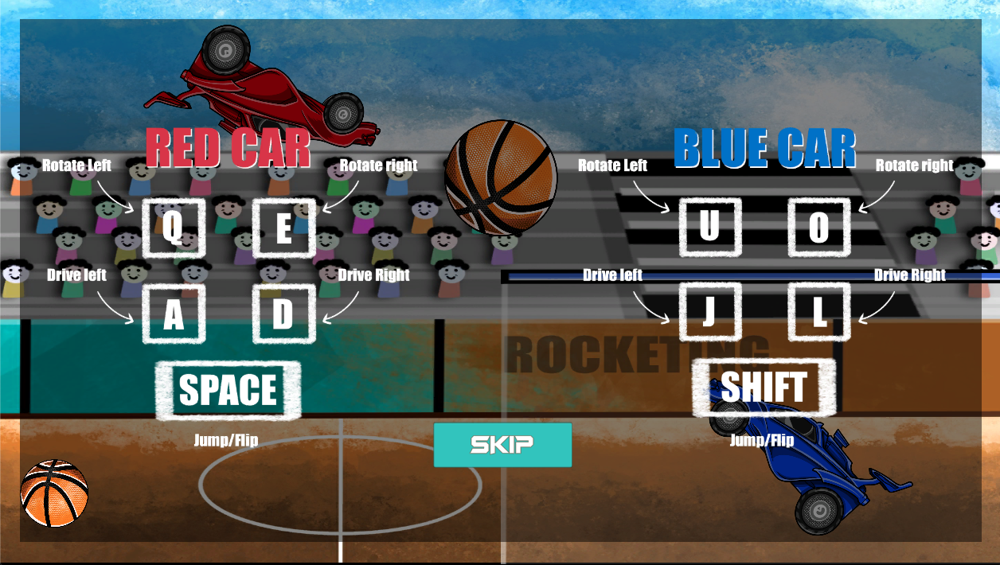
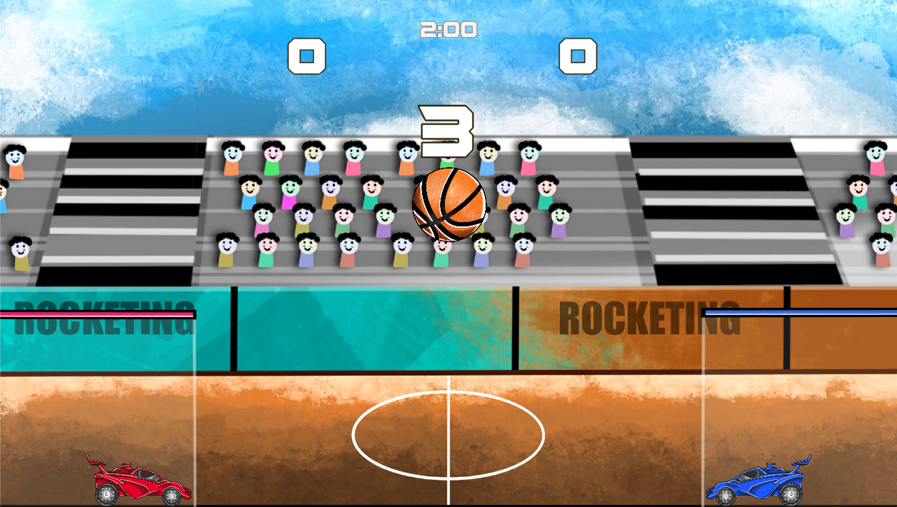
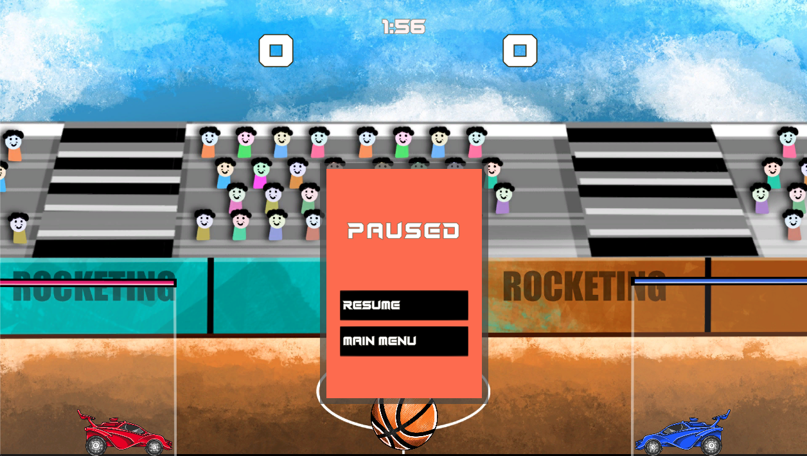
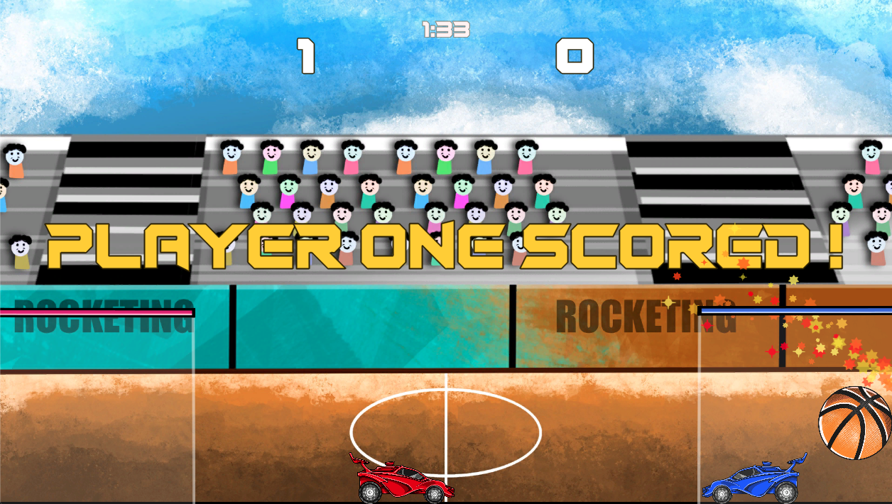
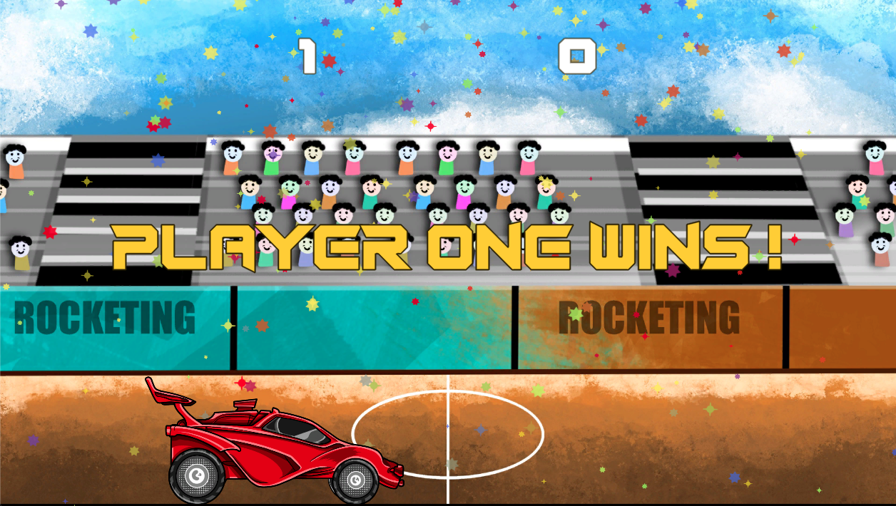
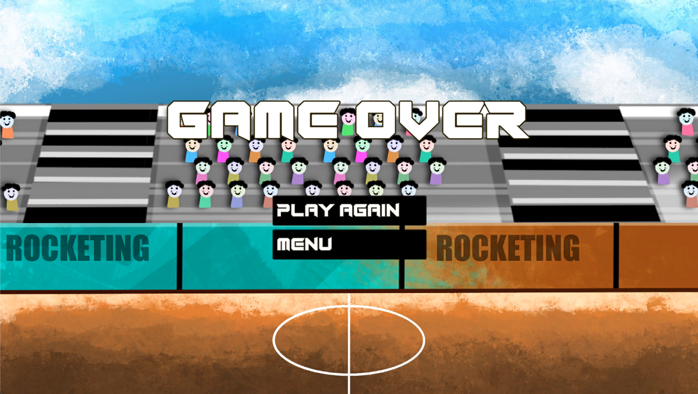

*The following images *
